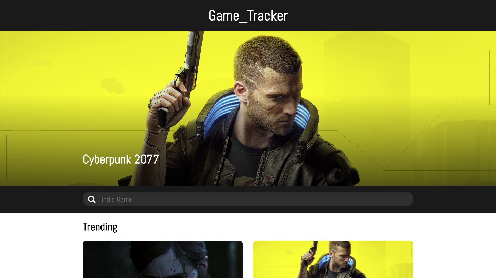
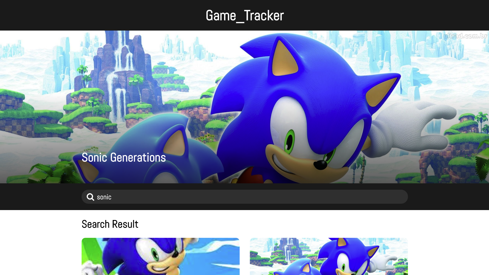
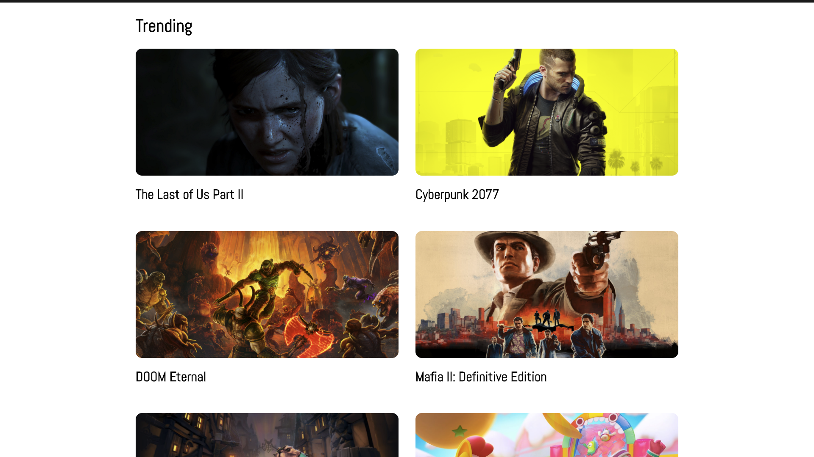
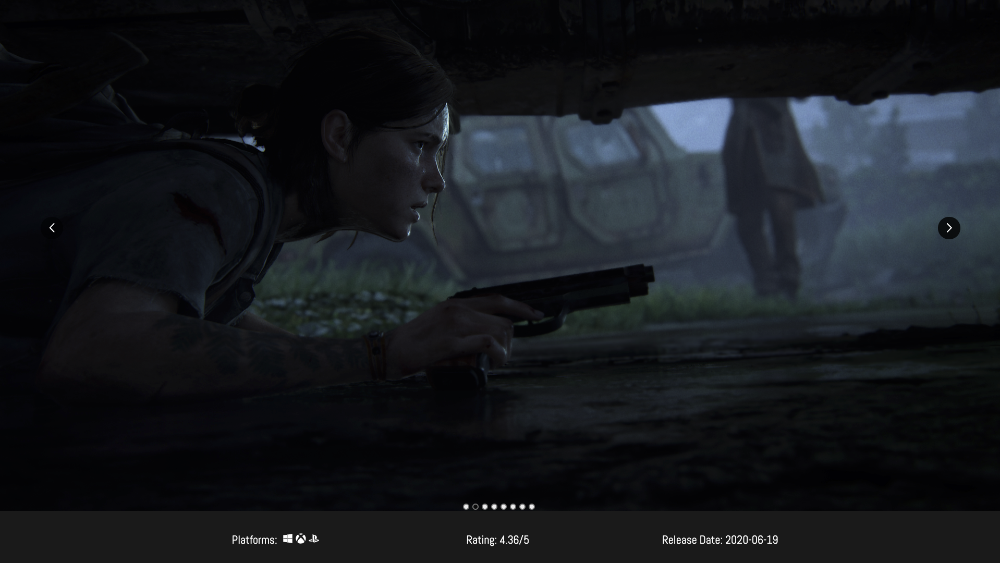

## Game_Tracker 🕹👾🎮

A video game database that actively tracks the top-trending games in the market and allows the user to search for information on any game ever published.

## Demo & Screenshots 🖥

[Live Demo - Click Here](https://mdlr-game-tracker.web.app/)

## Features 🌟
- Users can browse the current top-trending video games.
- Users can view screenshots, a gameplay videos, compatible platforms, release dates, and ratings.
- Users can use predictive search for any video game ever published.

## Built with 🔧
- React (custom hooks)
- Firebase
- RAWG API

## Getting Started 👨‍🚀
1. Fork and Star ⭐️ this repository
2. `git clone` to your local directory
3. `cd game-tracker`
4. Run `npm install`
5. Run `npm start` to start the frontend 🎉

## Author, License and Contributions
MIT © Michael De La Rosa

Contributions are always welcome!